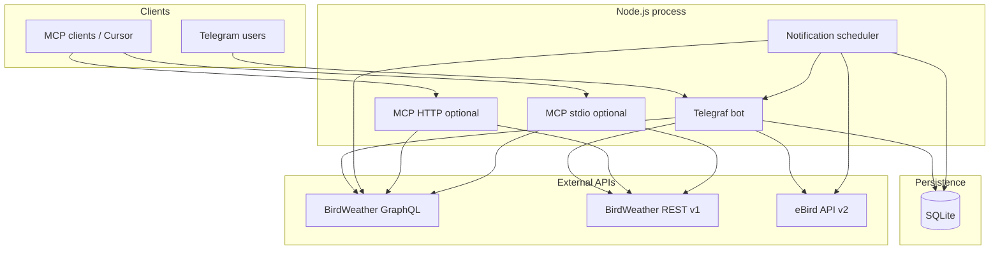

# Architecture

## High-level diagram



## Source layout

| Path | Responsibility |
|------|----------------|
| `src/index.ts` | Migrate DB, start MCP HTTP (if configured), scheduler, `bot.launch()` |
| `src/bot/bot.ts` | Command wiring, help text |
| `src/bot/registration.ts` | Multi-step `/register` session |
| `src/bot/birdweatherContext.ts` | Auth guards, filters, `fetchRecentDetections` |
| `src/bot/ebirdCommands.ts` | eBird command handlers |
| `src/bot/formatters/*` | Telegram HTML for stations, species, detections, eBird |
| `src/birdweather/` | GraphQL client, queries, service factories, REST detections |
| `src/ebird/` | eBird HTTP client, taxonomy cache, enrich, rarity, geo helpers |
| `src/integrations/detectionEnrichment.ts` | Orchestrates species + rarity enrichment |
| `src/subscriptions/` | Scheduler, notification pipeline, dedupe, cooldown, seeding |
| `src/db/` | Schema, accounts, registration sessions, station geo |
| `src/mcp/` | MCP server tools, HTTP transport, Bearer auth |
| `src/config/` | Zod env parsing, owner check, MCP env |

## API usage

### BirdWeather GraphQL

- Endpoint: `BIRDWEATHER_GRAPHQL_ENDPOINT` (default `https://app.birdweather.com/graphql`).
- Auth: `Authorization: Bearer <token>` per request.
- **Public service** (`BIRDWEATHER_API_TOKEN`): `stations`, `searchSpecies` only.
- **Station service** (per-user or env station token): `station`, `detections`, `topSpecies`.

### BirdWeather REST

- Used for token validation at registration and `list_detections` / subscribe seeding.
- `fetchStationDetections(stationToken, limit)` in `src/birdweather/rest.ts`.

### eBird API 2.0

- Base: `https://api.ebird.org/v2`
- Header: `X-eBirdApiToken`
- Endpoints used: taxonomy, reverse region, geo recent/notable, regional recent/notable, regional species list, geo species recent.
- Reference: [eBird API 2.0 Postman docs](https://documenter.getpostman.com/view/664302/S1ENwy59)

## Notification pipeline

```
scheduler tick
  → listActiveSubscriptions()
  → for each subscription:
       skip if paused
       load birdweather_accounts (must match station_id)
       GraphQL detections (NOTIFICATION_FETCH_LIMIT)
       applyDetectionFilters (score, confidence, probability)
       for each detection (oldest first):
         if dedupe.seen → continue
         if species cooldown → mark dedupe, continue
         enrichDetection (eBird links + rarity)
         sendMessage HTML + inline keyboard
         dedupe.mark + recordSpeciesNotified
```

**Species key:** derived in `speciesKey.ts` from scientific name (and related fields) so repeat alerts collapse to one species identity.

## Database tables

| Table | Purpose |
|-------|---------|
| `birdweather_accounts` | `chat_id` → `station_id`, `station_token`, name |
| `registration_sessions` | In-progress `/register` steps |
| `station_subscriptions` | Alert targets per chat |
| `chat_settings` | Filters, pause, soundscape links, eBird region override |
| `delivered_detections` | Notification dedupe by detection ID |
| `species_last_notified` | Cooldown timestamps per species/station/chat |
| `station_geo` | Lat/lng, privacy flag, eBird region code cache |

## Token model

```
TELEGRAM_BOT_TOKEN          → always required
BIRDWEATHER_API_TOKEN       → optional; public catalog; owner-only in bot
BOT_OWNER_TELEGRAM_ID       → required for owner gating when API token set
Per-chat station_token      → from /register; station GraphQL + notify poll
BIRDWEATHER_STATION_TOKEN   → optional; MCP station tools only (env)
EBIRD_API_TOKEN             → optional; enrichment + eBird commands
MCP_AUTH_TOKEN              → optional; HTTP MCP Bearer
```

Station tokens in SQLite are sensitive — never commit `data/*.sqlite` or `.env`.

## Testing

Vitest suites under `src/tests/` cover formatters, dedupe, cooldown, eBird client/taxonomy, enrichment, MCP, registration, notifications, station geo, etc.

Run: `pnpm test` (or `npm test`).
